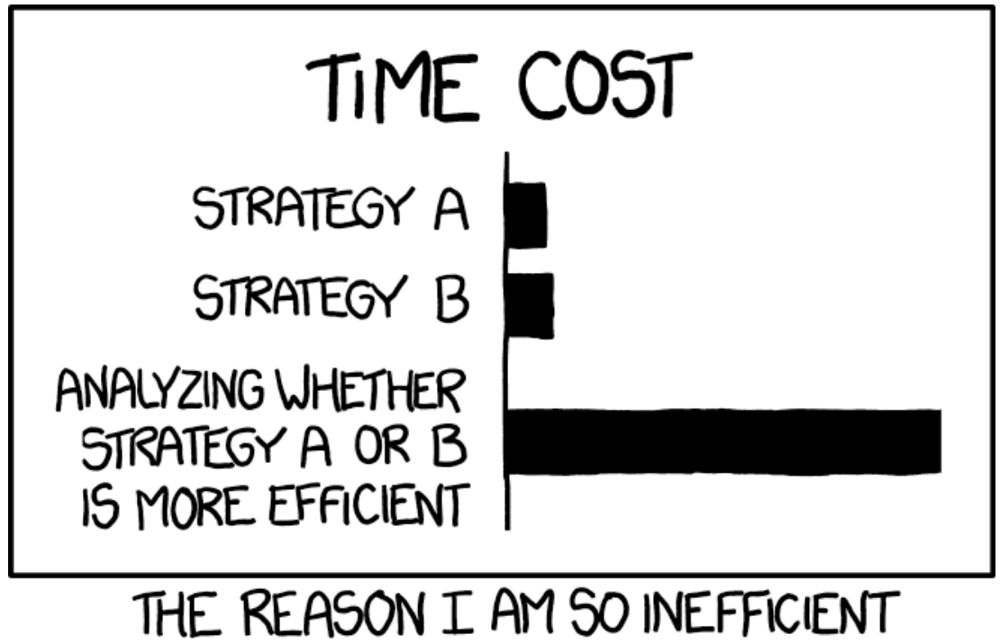

exclude: true

```{R, setup, include = F}
library(pacman)
p_load(
  broom, tidyverse,
  ggplot2, ggthemes, ggforce, ggridges, cowplot,
  latex2exp, viridis, extrafont, gridExtra,
  kableExtra, snakecase, janitor,
  DT, data.table, dplyr,
  lubridate, knitr, future, furrr,
  estimatr, FNN, parsnip,
  huxtable, here, magrittr
)
# Define colors
red_pink   = "#e64173"
turquoise  = "#20B2AA"
orange     = "#FFA500"
red        = "#fb6107"
blue       = "#3b3b9a"
green      = "#8bb174"
grey_light = "grey70"
grey_mid   = "grey50"
grey_dark  = "grey20"
purple     = "#6A5ACD"
slate      = "#314f4f"
# Knitr options
opts_chunk$set(
  comment = "#>",
  fig.align = "center",
  fig.height = 7,
  fig.width = 10.5,
  warning = F,
  message = F
)
opts_chunk$set(dev = "svg")
options(device = function(file, width, height) {
  svg(tempfile(), width = width, height = height)
})
options(knitr.table.format = "html")
```
---
class: inverse, middle
# Admin
---
name: admin
# Admin

Basic .hi[workflow] (best) practices (_i.e._, _Projects_)
- RStudio and projects
- Naming conventions
- Pipes (`%>%`)
- Data cleaning with `dplyr`

.note[Reminder] Readings for next week
- ISL Ch1–Ch2
- [Prediction Policy Problems](https://www.aeaweb.org/articles?id=10.1257/aer.p20151023) by Kleinberg .it[et al.] (2015)
---
layout: true
# Improving your workflow

---
class: inverse, middle
---
name: workflow-main

Data cleaning, manipulation, and analysis can be grueling, but optimizing your workflow can speed things along and make them less painful..super[.pink[†]]

.footnote[
.pink[†] Notice that I said .pink[*less*] painful.
]

.hi-slate[A few dimensions that can help]

- Understand how to interact with RStudio
- Use .mono[R] projects
- Follow reasonable naming conventions
- `dplyr` and pipes
- .grey-mid[Write your own functions (future lab)]
- .grey-mid[Use loops and parallelization (future lab)]
- .grey-light[Hire an intern/assistant to do your work for you]
---
layout: false
class: clear, middle

## Efficiency

```{R, fig xkcd, echo = F, out.width = '80%'}

```

.grey-light[Source: [xkcd](https://xkcd.com/1445/)]
---
layout: false
class: inverse, middle
# RStudio

---
name: rstudio
class: clear

Let's recap some of the major features in .mono[RStudio]...

```{R, pic_rstudio, echo = F}
knitr::include_graphics("images/rstudio/rstudio.png")
```
---
class: clear

First, you write your .mono[R] scripts (source code) in the .hi[Source] pane.

```{R, pic_rstudio_source1, echo = F}
knitr::include_graphics("images/rstudio/rstudio_source_rec.png")
```
---
class: clear

You can use the menubar or .mono[⇧+⌘+N] to create new .mono[R] scripts.

```{R, pic_rstudio_source2, echo = F}
knitr::include_graphics("images/rstudio/rstudio_source_arrow.png")
```
---
class: clear

To execute commands from your .mono[R] script, use .mono[⌘+Enter].

```{R, pic_rstudio_source3, echo = F}
knitr::include_graphics("images/rstudio/rstudio_source_ex.png")
```
---
class: clear

.mono[RStudio] will execute the command in the terminal.

```{R, pic_rstudio_source4, echo = F}
knitr::include_graphics("images/rstudio/rstudio_source_ex2.png")
```
---
class: clear

You can see our new object in the .hi[Environment] pane.

```{R, pic_rstudio_source5, echo = F}
knitr::include_graphics("images/rstudio/rstudio_source_ex3.png")
```
---
class: clear

The .hi-purple[History] tab (next to .hi[Environment]) records your old commands.

```{R, pic_rstudio_history, echo = F}
knitr::include_graphics("images/rstudio/rstudio_history.png")
```
---
class: clear

The .hi[Files] pane is file explorer.

```{R, pic_rstudio_files, echo = F}
knitr::include_graphics("images/rstudio/rstudio_files.png")
```
---
class: clear

The .hi[Plots] pane/tab shows... plots.

```{R, pic_rstudio_plots, echo = F}
knitr::include_graphics("images/rstudio/rstudio_plots.png")
```
---
class: clear

.hi[Packages] shows installed packages

```{R, pic_rstudio_packages, echo = F}
knitr::include_graphics("images/rstudio/rstudio_packages.png")
```
---
count: false
class: clear

.hi[Packages] shows installed packages and whether they are .hi-purple[loaded].

```{R, pic_rstudio_packages2, echo = F}
knitr::include_graphics("images/rstudio/rstudio_packages2.png")
```
---
class: clear

The .hi[Help] tab shows help documentation (also accessible via `?`).

```{R, pic_rstudio_help, echo = F}
knitr::include_graphics("images/rstudio/rstudio_help.png")
```
---
class: clear

Finally, you can customize the actual layout

```{R, pic_rstudio_layout, echo = F}
knitr::include_graphics("images/rstudio/rstudio_layout.png")
```
---
count: false
class: clear

Finally, you can customize the actual layout and many other items.

```{R, pic_rstudio_customize, echo = F}
knitr::include_graphics("images/rstudio/rstudio_customize.png")
```
---
name: best-practices
# .mono[R] and .mono[RStudio]
## Related best practices

1. Write code in .mono[R] scripts. Troubleshoot in .mono[RStudio]. Then run the scripts.

1. Comment your code. (`# This is a comment`)

1. Name objects/variables/files with intelligible, standardized names.
  - .hi-purple[BAD] `ALLCARS`, `Vl123a8`, `a.fun`, `cens.12931`, `cens.12933`
  - .hi-pink[GOOD] `unique_cars`, `health_df`, `sim_fun`, `is_female`, `age`

1. Write code that is readable (see comments comment above).

1. Use projects in .mono[RStudio] (next). And organize your projects.
---
layout: true
# Projects

---
class: inverse, middle

---
name: projects

Projects in .mono[R] offer several benefits

1. Act as an .hi[anchor] for working with files.

1. Make your work (projects) easily .hi[reproducible]..super[.pink[†]]

1. Help you .hi[quickly jump back] into your work.

.footnote[.pink[†] In this class, we're assuming reproducibility is good/desirable.]

---
layout: false
class: clear

To start a new project, hit the .hi[project icon].

```{R, pic_rstudio_projects, echo = F}
knitr::include_graphics("images/rstudio/rstudio_projects.png")
```
---
class: clear

You'll then choose the folder/directory where your project lives.

```{R, pic_rstudio_projects2, echo = F}
knitr::include_graphics("images/rstudio/rstudio_projects2.png")
```
---
class: clear

If you open (double click) a project, .mono[RStudio] opens .mono[R] in that location.

```{R, pic_rstudio_projects3, echo = F}
knitr::include_graphics("images/rstudio/rstudio_projects3.png")
```
---
count: false
class: clear

.mono[RStudio] will 'load' your previous setup (pane setup, scripts, *etc.*).

```{R, pic_rstudio_projects3b, echo = F}
knitr::include_graphics("images/rstudio/rstudio_projects3.png")
```
---
layout: true
# .mono[R] and .mono[RStudio]
## Projects

---

.hi-purple[Without a project], you will need to define long file paths that you'll need to keep updating as folder names/locations change.

--

`dir_class <- "/Users/edwardarubin/Dropbox/UO/Teaching/EC525S19/"`
<br>`dir_labs <- paste0(dir_class, "NotesLab/")`
<br>`dir_lab03 <- paste0(dir_labs, "03RInput/")`
<br>`sample_df <- read.csv(paste0(dir_lab03, "sample.csv"))`

--

.hi-pink[With a project], .mono[R] automatically references the project's folder.

`sample_df <- read.csv("sample.csv")`

--

.note[Double-plus bonus] The [`here`](https://github.com/r-lib/here) package extends projects' reproducibility.
---
layout: true
# Pipes and dplyr

---
class: inverse, middle

---
## Introduction

1. Pipes (`%>%`) make your life easier..super[.pink[†]]

1. `dplyr` is your data-work friend.

.footnote[.pink[†] Check out `magrittr` for more pipe options, _e.g._, `%<>%`.]
---
name: pipes

## Pipes

We can't go much deeper into the land of `dplyr` without mentioning pipes.

--

A *pipe* in programming allows you to take the output of one function and plug it into another function as an argument/input.

--

In `dplyr`, the expression for a pipe is `%>%`.

--

.mono[R]'s pipe specifically plugs the returned object to the .pink[left] of the pipe into the first argument of the function on the .purple[right] fo the pipe, _e.g._,

--

```{R, ex_pipe_simple}
rnorm(10) %>% mean()
```
---

## Pipes

Pipes help avoid lots of nested functions, prevent excessive writing to your disc, and increase the readability of our .mono[R] scripts.

--

.ex[Example] Three ways to draw 100 N(0,1) observations and calculate the interquartile range (IQR: difference between the 75.super[th] and 25.super[th] percentiles).

```{R, ex_pipe_iqr, eval = F}
# Save each intermediate step
draw <- rnorm(100)
end_points <- quantile(draw, probs = c(0.25, 0.75))
diff(end_points)
# Lots of nesting
diff(quantile(rnorm(100), probs = c(0.25, 0.75)))
# Piping 💪
rnorm(100) %>% quantile(probs = c(0.25, 0.75)) %>% diff()
```
---

## Pipes

By default, .mono[R] pipes the output from the LHS of the pipe into<br>the .hi[first] argument of the function on the RHS of the pipe.

--

*E.g.*, `a %>% fun(3)` is equivalent to `fun(arg1 = a, arg2 = 3)`.

--

If you want to pipe output into a different argument, you use a period (`.`).

--

- `b %>% fun(arg1 = 3, .)` is equivalent to `fun(arg1 = 3, arg2 = b)`.
- `b %>% fun(3, .)` is also equivalent to `fun(arg1 = 3, arg2 = b)`.

--
- `b %>% fun(., .)` is equivalent to `fun(arg1 = b, arg2 = b)`.

--

The `magrittr` package contains even more piping power.<sup>.pink[†]</sup>

.footnote[.pink[†] `magrittr` = Magritte (of [*this is not a pipe*](https://en.wikipedia.org/wiki/The_Treachery_of_Images) fame) plus .mono[R].]
---
layout: true
# dplyr
---
class: inverse, middle
---
name: dplyr

## Intro

It's a package.
--
 `dplyr` is not installed by default, so you'll need to install it.<sup>.pink[†]</sup>

.footnote[.pink[†] or just `p_load(dplyr)` after loading `pacman`.]

--

`dplyr` is part of the [`tidyverse`](https://dplyr.tidyverse.org/) (Hadleyverse), and it follows a grammar-based approach to programming/data work.

--

- `data` compose the subjects of your stories

- `dplyr` provides the *verbs* (action words)
:<br> `filter()`, `mutate()`, `select()`, `group_by()`, `summarize()`, `arrange()`

--

.hi-slate[*Bonus*] `dplyr` is pretty fast and able to interact with SQL databases.
---
name: mutate

## Manipulating variables: `mutate()`

`dplyr` streamlines adding/manipulating variables in your data frame.

.hi-slate[Function] `mutate(.data, ...)`

- .pink[Required argument] `.data`, an existing data frame

- .pink[Additional arguments] Names and values of the new variables

- .pink[Output] An updated data frame

--

.ex[Example]
```{R, ex_mutate1, eval = F}
mutate(.data = our_df, new1 = 7, new2 = x * y)
```

---

## `mutate()`

.ex[Example] Take the data frame

```{R, ex_mutate2_df}
my_df <- data.frame(x = 1:3, y = 5:7)
```


--

`mutate()` allows us to create many new variables with one call.

.pull-left[

```{R, ex_mutate2, eval = F}
mutate(.data = my_df,
  xy = x * y,
  x2 = x^2,
  xy2 = xy^2,
  is_max = x == max(x)
)
```

]
--
.pull-right[

```{R, ex_mutate2_result, echo = F, results = 'asis'}
mutate(.data = my_df,
  xy = x * y,
  x2 = x^2,
  xy2 = xy^2,
  is_max = x == max(x)
) %>% DT::datatable(rownames = F, options = list(dom = 't'))
```

Notice `mutate()` returns the original *and* new columns.

]
---
name: transmute

## `mutate()` *vs.* `transmute()`

As their names imply, `mutate()` and `transmute()` are very similar functions.

- `mutate()` returns the .pink[original] *and* .purple[new] columns (variables).

- `transmute()` returns only the .purple[new] columns (variables).

--

.slate[*Note*] Both functions return a new object as *output*—they do not update the object in .mono[R]'s memory. (This is the case for all functions in `dplyr`.)
---

## `%>%` and `dplyr`

Each `dplyr` function begins with a `.data` argument so that you can easily pipe in data frames (recall: `mutate(.data, ...)`).

--

The common workflow in `dplyr` will look something like

`new_df <- old_df %>% mutate(cool stuff here)`

which takes `old_df`, does some cool stuff with `mutate()`, and then saves the output of `mutate()` as `new_df`.
---

## `filter()`

The `filter()` function does what its name implies: it .b[filters the rows] of your data frame .b[based upon logical conditions].

---
layout: true

# dplyr
## `filter()`

The `filter()` function does what its name implies: it .b[filters the rows] of your data frame .b[based upon logical conditions].

.ex[Example]

.pull-left[
```{R, ex_filter}
# Create a dataset
some_df <- data.frame(
  x = 1:10,
  y = 11:20
)
```
]

---
name: filter
count: false

--

.pull-right[
```{R, ex_filter1, eval = F}
# Only keep rows where x is 3
some_df %>% filter(x == 3)
```
```{R, ex_filter1b, echo = F, out.width = '25%'}
# Only keep rows where x is 3
some_df %>% filter(x == 3) %>%
datatable(rownames = F,options = list(dom = 't'), width = 200)
```
]
---

.pull-right[
```{R, ex_filter2, eval = F}
# Only keep rows where x > 7
some_df %>% filter(x > 7)
```
```{R, ex_filter2b, echo = F}
# Only keep rows where x > 7
some_df %>% filter(x > 7) %>%
datatable(rownames = F,options = list(dom = 't'), width = 200)
```
]
---

.pull-right[
```{R, ex_filter3, eval = F}
# Keep rows where y/x > 3
some_df %>% filter(y/x > 3)
```
```{R, ex_filter3b, echo = F}
# Keep rows where y/x > 3
some_df %>% filter(y/x > 3) %>%
datatable(rownames = F,options = list(dom = 't'), width = 200)
```
]
---

.pull-right[
```{R, ex_filter4, eval = F}
# Keep rows where x>8 OR y<12
some_df %>%
  filter(x > 8 | y < 12)
```
```{R, ex_filter4b, echo = F}
# Keep rows where x>8 OR y<12
some_df %>%
  filter(x > 8 | y < 12) %>%
  datatable(rownames = F,options = list(dom = 't'), width = 200)
```
]
---

.pull-right[
```{R, ex_filter5, eval = F}
# Keep rows where 16<=y<=18
some_df %>%
  filter(between(y, 16, 18))
```
```{R, ex_filter5b, echo = F}
# Keep rows where 16<=y<=18
some_df %>%
  filter(between(y, 16, 18)) %>%
  datatable(rownames = F,options = list(dom = 't'), width = 200)
```
]
---

.pull-right[
```{R, ex_filter6, eval = F}
# Keep rows where y > 20
some_df %>% filter(y > 20)
```
```{R, ex_filter6b, echo = F}
# Keep rows where y > 20
some_df %>% filter(y > 20) %>%
  datatable(rownames = F,options = list(dom = 't'), width = 200, height = 100)
```
]

If you filter your data frame down to nothing, .mono[R] returns a 0-row data frame with the names/number of columns from the original data frame.
---
layout: true
# dplyr
---
name: select

## `select()`

Just as .purple[`filter()`] grabs .purple[row-based subsets] of your data frame,
<br>.pink[`select()`] grabs .pink[column-based subsets].

--

You can select columns using their .b[names]
<br>.pad-left[`our_df %>% select(var10, var100)`]

--

you can select columns using their .b[numbers]
<br>.pad-left[`our_df %>% select(10, 100)`]

--

or you can select columns using .b[helper fuctions]
<br>.pad-left[`our_df %>% select(starts_with("var10"))`]

--

`select()` helps you narrow down a dataset to its necessary features.
---
name: summarize

## `summarize()`

Hopefully you're starting to see that functions' names in `dplyr` tell you what the function does.

`summarize()`<sup>.pink[†]</sup> summarizes variables—you choose the variables and the summaries (_e.g._, `mean()` or `min()`).

.footnote[.pink[†] or `summarise()` if you ❤️️ 🇬🇧]

--

```{R, ex_summarize, eval = F}
the_df %>% summarize(
  mean(x), mean(y), mean(z),
  min(x), max(x),
)
```
would return a 1×5 data frame with the means of `x`, `y`, and `z`; the minimum of `x`; and the maximum of `x`.
---
name: group_summarize

## `summarize()` and `group_by()`

While sample-wide summarizes are certainly interesting, `dplyr` has one last gem for us: `group_by()`.

`group_by()` groups your observations by the variable(s) that you name.

--

Specifically, `group_by()` returns a *grouped data frame* that you can then feed to `summarize()`, `mutate()`, or `transmuate` to perform grouped calculations, _e.g._, each group's mean.


---

## Example: Grouped summaries


.pull-left[.small[
```{R, ex_group1}
# Create a new data frame
our_df <- data.frame(
  x = 1:6,
  y = c(0, 1),
  grp = rep(c("A", "B"), each = 3)
)
```

```{R, ex_group2, echo = F}
our_df %>% datatable(rownames = F,options = list(dom = 't'), width = '50%', height = 250)
```
]]

--

.pull-right[.small[
```{R, ex_group3, eval = F}
# For dataset 'our_df'...
our_df %>%
  # Group by 'grp'
  group_by(grp) %>%
  # Take means of 'x' and 'y'
  summarize(mean(x), mean(y))
```

```{R, ex_group4, echo = F}
our_df %>%
  group_by(grp) %>%
  summarize(mean(x), mean(y)) %>%
  datatable(rownames = F,options = list(dom = 't'), width = '100%', height = 110) %>%
  formatRound(columns=c('mean(x)', 'mean(y)'), digits = 3)
```
]]
---

## Example: Grouped mutation

.pull-left[.small[
```{R, ex_group5}
# Create a new data frame
our_df <- data.frame(
  x = 1:6,
  y = c(0, 1),
  grp = rep(c("A", "B"), each = 3)
)
```

```{R, ex_group6, echo = F}
our_df %>% datatable(rownames = F,options = list(dom = 't'), width = '50%', height = 250)
```
]]

--

.pull-right[.small[
```{R, ex_group7, eval = F}
# Add grp means for x and y
our_df %>%
  group_by(grp) %>%
  mutate(
    x_m = mean(x), y_m = mean(y)
  )
```

```{R, ex_group8, echo = F}
our_df %>%
  group_by(grp) %>%
  mutate(x_m = mean(x), y_m = mean(y)) %>%
  datatable(rownames = F,options = list(dom = 't'), height = 250) %>%
  formatRound(columns=c('x_m', 'y_m'), digits = 3)
```
]]

---
name: arrange

## `arrange()`

`arrange()` will sorts the rows of a data frame using the inputted columns.

.mono[R] defaults to starting with the "lowest" (smallest) at the top of the data frame. Use a `-` in front of the variable's name to reverse sort.

---
layout: false
class: clear, middle

.pull-left[
```{R, ex_arrange1, eval = F}
# As is
our_df
```
```{R, ex_arrange1b, echo = F}
# As is
our_df %>%
datatable(rownames = F,options = list(dom = 't'), height = 250)
```
]

.pull-right[
```{R, ex_arrange2, eval = F}
# Arrang by y, grp, then -x
our_df %>% arrange(y, grp, -x)
```
```{R, ex_arrange2b, echo = F}
# Arrang by y, grp, then -x
our_df %>% arrange(y, grp, -x) %>%
datatable(rownames = F,options = list(dom = 't'), height = 250)
```
]

---
name: tidyverse
# The tidyverse

There's more! `dplyr` and .purple[`tidyr`] offer even more....super[.pink[†]]

.footnote[
.pink[†] And these are only two of the packages in the `tidyverse`.
]

- .note[Viewing data] `glimpse()`, `top_n()`
- .note[Sampling] `sample_n()`, `sample_frac()`
- .note[Summaries] `first()`, `last()`, `nth()`, `n_distinct()`
- .note[Duplicates] `distinct()`
- .note[Missingness] `na_if()`, .purple[`replace_na()`], .purple[`drop_na()`], .purple[`fill()`]

--

The folks at RStudio have put together some great cheatsheets, *e.g.*,

- [`dplyr`](https://raw.githack.com/edrubin/EC524W20/master/resources/cheatsheet-dplyr.pdf)
- [data import](https://raw.githack.com/edrubin/EC524W20/master/resources/cheatsheet-data-import.pdf)
- [data wrangling](https://raw.githack.com/edrubin/EC524W20/master/resources/cheatsheet-data-wrangling.pdf)
---
layout: false
# Table of contents

.col-left[
.small[
#### Admin
- [Today and upcoming](#admin)

#### Workflow
- [General](#workflow-main)
- [RStudio](#rstudio)
- [Related best practies](#best-practices)
- [Projects](#projects)
]]

.col-right[
.small[
#### `dplyr`
- [Pipes](#pipes)
- [`mutate`](#mutate)
- [`transmute()`](#transmute)
- [`arrange`](#arrange)
- [`filter()`](#filter)
- [`select()`](#select)
- [`summarize`](#summarize)
- [`summarize()` and `group_by()`](#group_summarize)
- [The `tidyverse`](#tidyverse)
]
]

